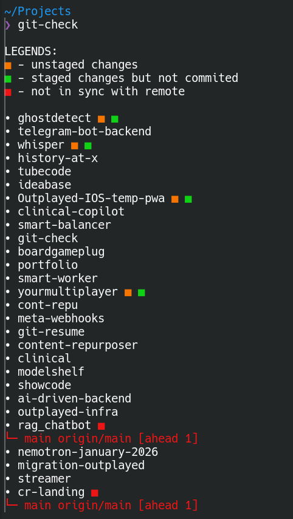

# git-check

A CLI tool that scans all folders in your current directory and shows their git status at a glance — unstaged changes, staged but uncommitted files, and branches out of sync with remote.

## Prerequisites

- [Bun](https://bun.sh) — JavaScript runtime used to run and install the tool
- [Git](https://git-scm.com) — required for scanning repository status

## Setup

```bash
bun install
```

## Usage

Run this from a directory that contains multiple git repos.

```bash
git-check
```

Lists each repo with color-coded markers:

- Yellow — has unstaged changes
- Green — has staged changes (not yet committed)
- Red — branch is ahead/behind remote

Branches that are out of sync are shown in a tree view below the repo name.

### Commands

| Command | Description |
|---------|-------------|
| `git-check` | Show git status overview for all repos |
| `git-check stage <repos...>` | Stage changes in specific repos |
| `git-check stage-all` | Stage changes in all repos |
| `git-check commit <repos...>` | Stage and commit specific repos |
| `git-check commit-all` | Stage and commit all repos |
| `git-check push <repos...>` | Stage, commit, and push specific repos |
| `git-check push-all` | Stage, commit, and push all repos |

## Demo



## Install globally

To use `git-check` as a command from anywhere:

```bash
bun link
```

Then simply run:

```bash
git-check
```
